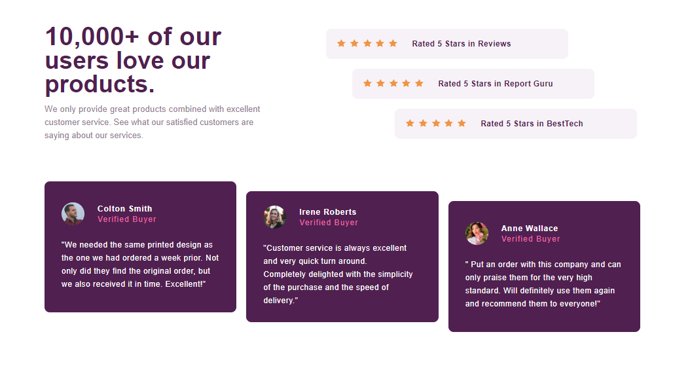

# Frontend Mentor - Social proof section solution

This is a solution to the [Social proof section challenge on Frontend](https://www.frontendmentor.io/challenges/social-proof-section-6e0qTv_bA). Frontend challenges help you improve your coding skills by building realistic projects. 

## Table of contents

- My process

  - HTML & CSS

- Author
  - Frontend Mentor: [NFD-cesar](https://www.frontendmentor.io/profile/NFD-cesar)
  - Twitter: [NFD César Ramírez](https://twitter.com/nfd_cesar)

### Screenshot

### Links

- Live Site URL: [Add live site URL here](https://your-live-site-url.com)

## My process
### Built with

- Semantic HTML5 markup
- CSS custom properties
- Flexbox
- Mobile-first workflow